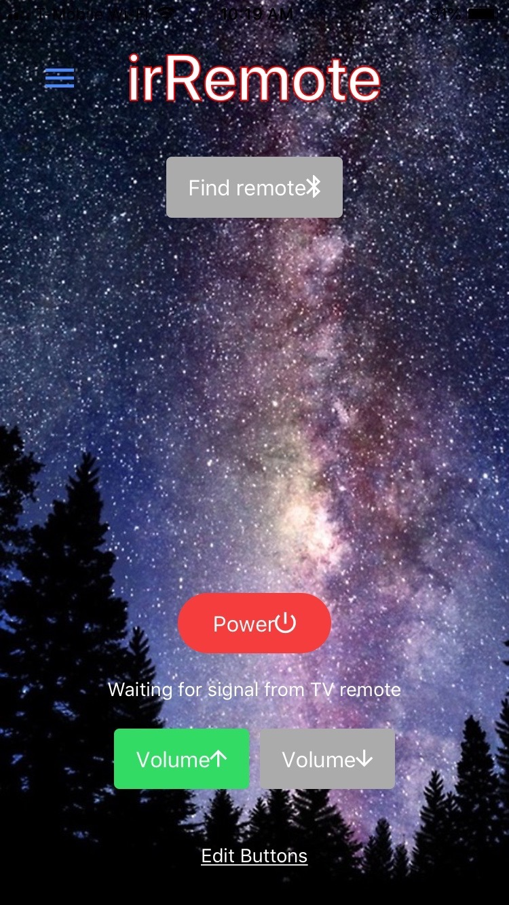

# irRemoteApp

The irRemote project replaces a TV remote.

It consists of an Ionic app and a nRF52832 peripheral. The peripheral learns infrared (IR) signals from the user's TV remote. The app controls the peripheral over Bluetooth Low Energy (BLE), including when to learn and when to send IR signals.

This is a proof-of-concept, rather than a product to bring to market. It was created as a coding example for LaunchCode.

## Images of App Pages

  

## Getting Started

These instructions will help you test the app on an iOS or Android device.

### Prerequisites

Install the Ionic framework: https://ccoenraets.github.io/ionic-tutorial/install-ionic.html

Download the Ionic DevApp to your iOS or Android device: https://ionicframework.com/docs/pro/devapp/

Pull this repository to your computer.

### Running the App

To run the app on your device, make sure that your computer and device are connected to the same network. In your computer terminal, cd into the folder containing the irRemoteApp repository.

Run command:

'''
ionic serve -c
'''

On your device, open DevApp and the irRemoteApp should appear.

To utilize all features of the app, connect to an nRF52 peripheral (see the irRemotePeripheral repository).

## Author
- Ole Andreas Birkedal

## Acknowledgements
- Thank you to Don Coleman for writing the Ionic BLE Peripheral plugin and for providing examples on how to use it. I relied especially on his Connect example. See: https://github.com/don/ionic-ble-examples
